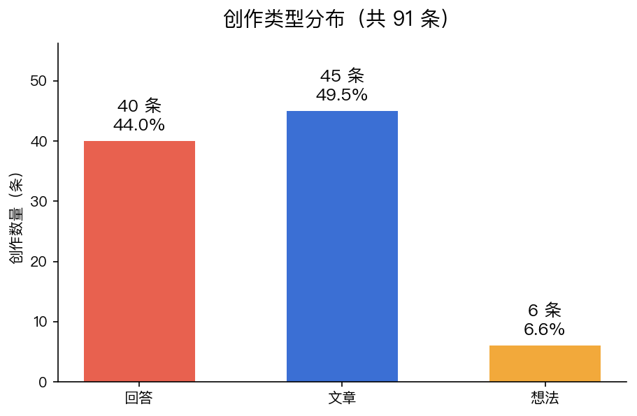
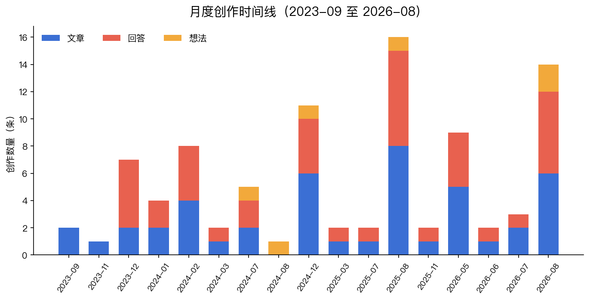
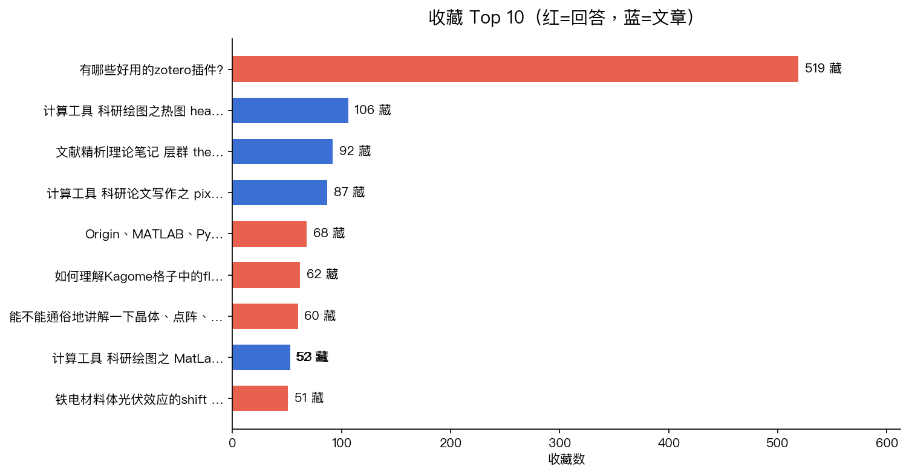
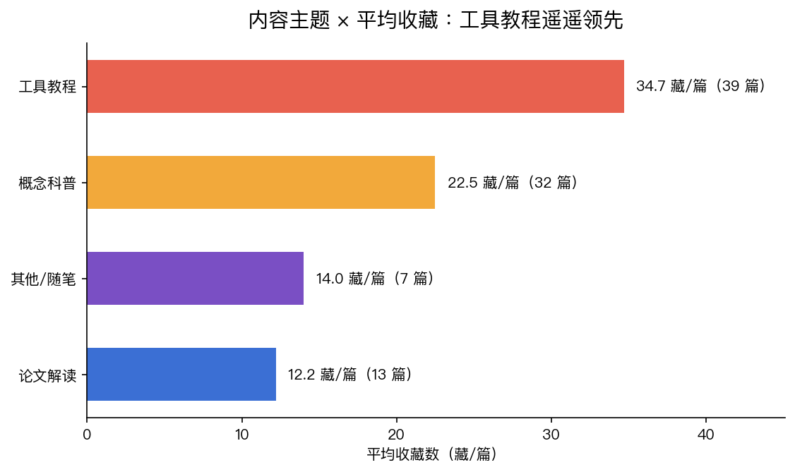
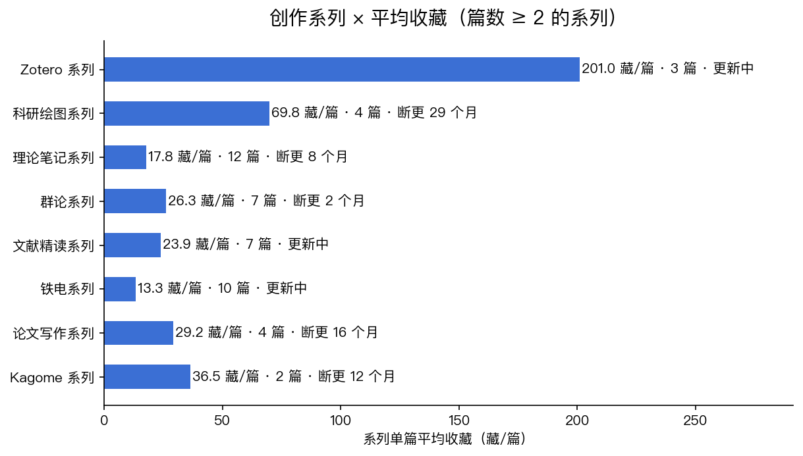
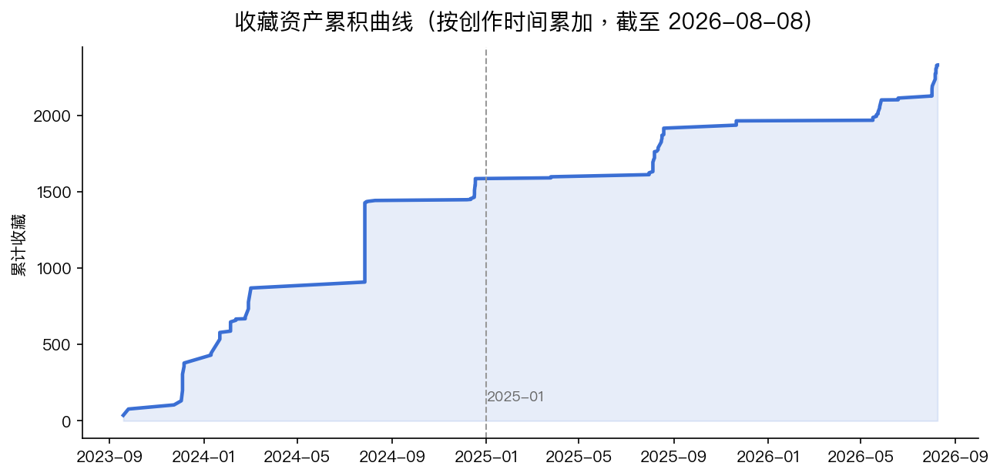
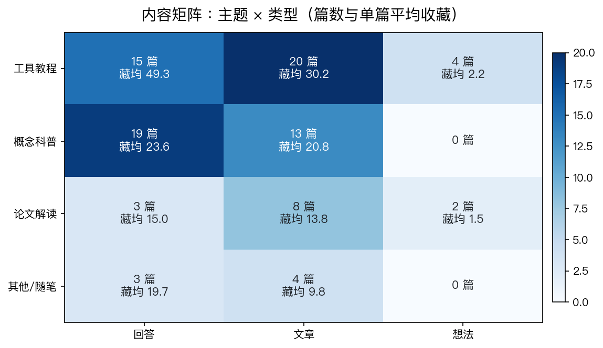

# 我的知乎 3 年创作体检报告：91 条内容、2329 次收藏背后的读者偏好

> 数据源：知乎开放平台 Zhihu CLI `me contents` 全量抓取（91 条，一次性抓取并缓存）
> 统计时间：2026-08-08 | 报告由 `src/report_generator.py` 模板化自动生成（数据见 `output/stats.json`）

---

## 一、摘要

从 2023 年 9 月到 2026 年 8 月，我共发布 **91 条创作**：文章 45 篇、回答 40 个、想法 6 条，累计获得 **1011 个赞、2329 次收藏、97 条评论**。全库收藏/点赞比为 **2.30**——读者明显把内容当作「资料」收藏而非单纯点赞。

核心结论（均有数据支撑）：

1. **工具教程是收藏基本盘**：39 篇工具教程（占 42.9%）贡献全部收藏的 **58.1%**，单篇平均收藏 34.7，是论文解读的 **2.8 倍**；
2. **概念科普是长尾资产**：2023–2024 年发布的 41 条内容至今贡献 **68.1%** 的收藏，收藏 Top 10 中有 9 条来自那个时期；
3. **最大机会是「科研绘图系列」断更**：该系列 4 篇、平均 69.8 藏/篇（全库第 2），已断更 **892 天**——这是下季度最值得优先续更的方向；
4. **内容高度依赖头部**：收藏 Top 10 占全库 **49.4%**，Top 20%（18 条）占 **64.3%**；
5. **「工具教程 × 回答」是最高效组合**（15 篇、藏均 49.3），而「论文解读 × 回答」仅 3 篇——选题空白明确；
6. **近期数据下滑是「节奏+类型」问题，不是内容质量**：近 90 天单篇平均收藏 13.1（历史 31.2），但 8 月新发的「给 Zotero 装上 DeepSeek-V4-…」以 15.0 藏/天领跑全库。

---

## 二、总量与类型分布

| 类型 | 数量 | 占比 | 累计赞 | 累计藏 | 单篇平均赞 | 单篇平均藏 | 收藏中位数 |
|---|---:|---:|---:|---:|---:|---:|---:|
| 文章 | 45 | 49.5% | 476 | 1025 | 10.6 | 22.8 | 13 |
| 回答 | 40 | 44.0% | 508 | 1292 | 12.7 | 32.3 | 12.0 |
| 想法 | 6 | 6.6% | 27 | 12 | 4.5 | 2 | 1.5 |
| **合计** | **91** | 100% | **1011** | **2329** | **11.1** | **25.6** | **11** |

要点：

- **回答的单篇收藏效率最高**（32.3 藏/篇），「有哪些好用的zotero…」回答（519 藏）一个就贡献全库 22.3% 的收藏；
- 文章数量最多、单篇表现略低于回答，但**评论互动更强**（平均 1.3 条/篇 vs 回答 0.8），适合承载深度内容与讨论；
- 想法类表现最弱（平均 2 藏），属于「存在感」内容而非「资产」内容。

## 三、创作时间线：35 个月、17 个活跃月

- 时间跨度 **2023 → 2026**（35 个月），17 个月有产出，活跃月均 **5.4 条**；
- **2025-08 是创作高峰（16 条）**，2026-08（14 条）、2024-12（11 条）紧随其后；
- 年度分布：2023 年 10 条 → 2024 年 31 条 → 2025 年 22 条 → 2026 年 28 条，节奏从「偶尔爆发」转向「全年稳定」；
- 明显规律：**寒暑假前后（12–2 月、7–8 月）是主要输出窗口**。

## 四、收藏 Top 10 与点赞 Top 10

| 排名 | 收藏 | 点赞 | 类型 | 时间 | 标题 |
|---:|---:|---:|---|---|---|
| 1 | 519 | 151 | 回答 | 2024-07 | 有哪些好用的zotero插件? |
| 2 | 106 | 61 | 文章 | 2023-12 | 计算工具 科研绘图之热图 heatmap：MatLab、Python、Excel 和 Orgin 绘制方法全总结及横向比较 |
| 3 | 92 | 36 | 文章 | 2024-01 | 文献精析|理论笔记 层群 the 80 Layer Groups：概念，特征及其与点群、平移群、空间群和平面群的关系 |
| 4 | 87 | 23 | 文章 | 2024-03 | 计算工具 科研论文写作之 pix2tex：将数学公式图片转化为 LaTeX 代码 |
| 5 | 68 | 19 | 回答 | 2023-12 | Origin、MATLAB、Python 用于科研作图，哪个最好？ |
| 6 | 62 | 34 | 回答 | 2025-08 | 如何理解Kagome格子中的flat band？ |
| 7 | 60 | 36 | 回答 | 2024-02 | 能不能通俗地讲解一下晶体、点阵、点群、空间群之间的关系？它们的区别与联系？ |
| 8 | 53 | 28 | 文章 | 2024-02 | 计算工具 科研绘图之 MatLab .fig 文件的存储、处理及利用 |
| 9 | 52 | 21 | 文章 | 2024-01 | 计算工具 科研绘图之 MatLab 双纵轴曲线图：绘制场景、应用举例、相关代码及技巧 |
| 10 | 51 | 25 | 回答 | 2023-12 | 铁电材料体光伏效应的shift current应该怎么理解？ |

结构观察：

- **科研绘图系列 4 篇进 Top 10**，加上 Zotero 插件，工具教程类占 6 席；
- **概念科普 4 席**（「文献精析|理论笔记 层群 t…」、「如何理解Kagome格子中的…」、「能不能通俗地讲解一下晶体、点…」、「铁电材料体光伏效应的shif…」），其中 3 篇是回答；
- **9 条来自 2023–2024 年**，2025 年后进榜的是「如何理解Kagome格子中的fl…」（2025-08，62 藏）。

点赞 Top 10 与收藏榜高度重合（7/10），说明「赞与藏」正相关；差异点是**「文献精析 体光伏效应：含五边形链状结构的…」以 31 赞进点赞榜**（2023-09 发布）。

| 排名 | 点赞 | 收藏 | 类型 | 时间 | 标题 |
|---:|---:|---:|---|---|---|
| 1 | 151 | 519 | 回答 | 2024-07 | 有哪些好用的zotero插件? |
| 2 | 61 | 106 | 文章 | 2023-12 | 计算工具 科研绘图之热图 heatmap：MatLab、Python、Excel 和 Orgin 绘制方法全总结及横向比较 |
| 3 | 36 | 60 | 回答 | 2024-02 | 能不能通俗地讲解一下晶体、点阵、点群、空间群之间的关系？它们的区别与联系？ |
| 4 | 36 | 92 | 文章 | 2024-01 | 文献精析|理论笔记 层群 the 80 Layer Groups：概念，特征及其与点群、平移群、空间群和平面群的关系 |
| 5 | 34 | 62 | 回答 | 2025-08 | 如何理解Kagome格子中的flat band？ |
| 6 | 31 | 36 | 文章 | 2023-09 | 文献精析 体光伏效应：含五边形链状结构的二维热释电材料CuXX'Y |
| 7 | 28 | 46 | 回答 | 2026-08 | 为什么人们如此关心激子（exciton）？ |
| 8 | 28 | 53 | 文章 | 2024-02 | 计算工具 科研绘图之 MatLab .fig 文件的存储、处理及利用 |
| 9 | 26 | 42 | 回答 | 2025-08 | 二维材料的应用前景？ |
| 10 | 25 | 51 | 回答 | 2023-12 | 铁电材料体光伏效应的shift current应该怎么理解？ |

## 五、内容主题 × 表现：工具教程一骑绝尘

主题按标题+摘要关键词规则分类（方法见附录）：

| 主题 | 篇数 | 占比 | 累计收藏 | 收藏占比 | 单篇平均收藏 | 平均点赞 | 藏赞比 |
|---|---:|---:|---:|---:|---:|---:|---:|
| 工具教程 | 39 | 42.9% | 1354 | 58.1% | **34.7** | 13.7 | 2.54 |
| 概念科普 | 32 | 35.2% | 719 | 30.9% | **22.5** | 10.4 | 2.16 |
| 论文解读 | 13 | 14.3% | 158 | 6.8% | **12.2** | 6.9 | 1.76 |
| 其他/随笔 | 7 | 7.7% | 98 | 4.2% | **14** | 7.9 | 1.78 |

排序（按收藏）：**工具教程 ＞ 概念科普 ＞ 论文解读 ＞ 其他/随笔**，工具教程单篇收藏是论文解读的 **2.8 倍**。

## 六、近 90 天 vs 历史：下滑了吗？

| 指标 | 近 90 天（28 条） | 历史（63 条） | 全库 |
|---|---:|---:|---:|
| 累计赞 / 藏 / 评论 | 163 / 366 / 10 | 848 / 1963 / 87 | 1011 / 2329 / 97 |
| 单篇平均赞 | 5.8 | 13.5 | 11.1 |
| 单篇平均藏 | 13.1 | 31.2 | 25.6 |
| 藏赞比 | 2.25 | 2.31 | 2.3 |

表面看近 90 天单篇表现约为历史的 4–5 成，但拆开看：

- 近 90 天 28 条里，**论文解读类 6 条、想法/随笔类 5 条**，高收藏属性的「教程/科普」占比低于历史样本；
- 同期爆款依然出现：**为什么人们如此关心激子（excito…**（46 藏/28 赞，08-01）、**给 Zotero 装上 DeepSe…**（45 藏/6 赞，08-05）、**WannSymm 安装与使用教程**（45 藏/16 赞，05-27）；
- 「铁电性的统一定义（预印本 U…」29 藏/12 赞（08-06）；「磁性 Skyrmion 家族…」14 藏/7 赞（08-07）延续了文献解读路径。

**结论**：单篇均值下降主要来自新内容缺乏时间沉淀 + 近期类型结构偏移，单篇内容质量没有下降。

## 七、系列分析：谁在持续赚钱，谁断更了

按标题关键词把 91 条归入 9 个系列（覆盖 51 条，56.0%），按累计收藏排序：

| 系列 | 篇数 | 累计收藏 | 单篇平均收藏 | 首篇 | 末篇 | 断更 | 代表内容 |
|---|---:|---:|---:|---|---|---:|---|
| Zotero 系列 | 3 | 603 | **201** | 2024-07 | 2026-08 | 3 天 | 有哪些好用的zotero插件? |
| 科研绘图系列 | 4 | 279 | **69.8** | 2023-12 | 2024-02 | **892 天** | 计算工具 科研绘图之热图 heatmap：MatLab、Py |
| 理论笔记系列 | 12 | 214 | **17.8** | 2023-11 | 2025-11 | **260 天** | 理论笔记 群论chapter 2: 群表示理论完整解题手稿 |
| 群论系列 | 7 | 184 | **26.3** | 2023-12 | 2026-05 | **83 天** | 能不能通俗地讲解一下晶体、点阵、点群、空间群之间的关系？它们 |
| 文献精读系列 | 7 | 167 | **23.9** | 2023-09 | 2026-07 | 10 天 | 文献精析|理论笔记 层群 the 80 Layer Grou |
| 铁电系列 | 10 | 133 | **13.3** | 2023-12 | 2026-08 | 0 天 | 铁电材料体光伏效应的shift current应该怎么理解？ |
| 论文写作系列 | 4 | 117 | **29.2** | 2024-03 | 2025-03 | **501 天** | 计算工具 科研论文写作之 pix2tex：将数学公式图片转化 |
| Kagome 系列 | 2 | 73 | **36.5** | 2025-08 | 2025-08 | **368 天** | 如何理解Kagome格子中的flat band？ |
| Skyrmion 系列 | 2 | 22 | **11** | 2026-08 | 2026-08 | 1 天 | 磁性 Skyrmion 家族综述：从 Néel、Bloch  |

三个数据信号：

1. **科研绘图系列：平均 69.8 藏/篇、4 篇全在收藏 Top 10，却已断更 892 天（约 29 个月）**——这是全库最大的「沉睡资产」；
2. **论文写作系列：平均 29.2 藏/篇、断更 501 天**——与工具教程主题重合，且 pix2tex（藏赞比 3.78）证明该方向高收藏转化；
3. **Zotero 系列平均 201 藏/篇、断更仅 3 天**：单篇冠军 + 刚发布 Zotero × DeepSeek 教程，是当前最活跃也最值钱的系列。

## 八、头部集中度与收藏速率

**头部集中度**（爆款依赖度）：

| 指标 | 数值 | 含义 |
|---|---:|---|
| Top 1 占比 | 22.3% | 单条（有哪些好用的zote…）就占全库 22.3% 收藏 |
| Top 10 占比 | 49.4% | 前 10 条贡献近一半收藏 |
| Top 20%（18 条）占比 | 64.3% | 头部 1/5 内容贡献近 2/3 收藏 |
| 零互动内容 | 3 条（3.3%） | 全部集中在近期随笔/想法 |

**收藏速率榜**（收藏 ÷ 发布天数，衡量「起势」）：

| 收藏/天 | 天数 | 发布时间 | 内容 |
|---:|---:|---|---|
| 15.0 | 3 | 2026-08-05 | 给 Zotero 装上 DeepSeek-V4-Flash |
| 14.5 | 2 | 2026-08-06 | 铁电性的统一定义（预印本 Unified definition of ferro |
| 14.0 | 1 | 2026-08-07 | 磁性 Skyrmion 家族综述：从 Néel、Bloch 到 Meron、Ho |
| 10.67 | 3 | 2026-08-05 | 如何看待2026年7月31日发布的deepseek v4-flash更新？ |
| 8.0 | 1 | 2026-08-07 | 什么是 skyrmion？ |

阅读方式：**速率高的新内容 = 正在起势的选题方向**；当前新锐榜首「给 Zotero 装上 DeepSeek…」（15.0 藏/天）所在的工具/教程线最有势能。累积曲线则直观显示：**2023–2024 年建起了收藏基本盘，2025 年至今主要靠存量长尾与零星爆款增长**。

## 九、发布星期与标题特征（探索性）

| 星期 | 篇数 | 平均收藏 | 平均点赞 |
|---|---:|---:|---:|
| 周一 | 18 | 27.0 | 14.61 |
| 周二 | 10 | 20.1 | 8.1 |
| 周三 | 19 | 19.11 | 7.84 |
| 周四 | 9 | 15.33 | 7.44 |
| 周五 | 12 | 15.42 | 7.83 |
| 周六 | 17 | **43.06** | 15.06 |
| 周日 | 6 | **37.33** | 16.83 |

| 标题长度 | 篇数 | 平均收藏 | 平均点赞 |
|---|---:|---:|---:|
| ≤14 字 | 14 | 15.4 | 6.9 |
| 15–24 字 | 27 | **35.1** | 14.2 |
| 25–34 字 | 23 | 20.3 | 9.4 |
| ≥35 字 | 27 | 25.8 | 11.7 |

探索性观察（样本有限，仅供参考）：**周末发布的内容单篇收藏明显更高**（周六 43.06 / 周日 37.33 vs 工作日 15–27）；**15–24 字的标题表现最好**（35.1 藏/篇）。两者都值得在未来用「发布日 + 标题长度」做 A/B 验证。

## 十、内容矩阵：主题 × 类型的高效组合与空白格

| 主题 × 类型 | 篇数 | 单篇平均收藏 | 累计收藏 | 解读 |
|---|---:|---:|---:|---|
| 工具教程 × 回答 | 15 | **49.3** | 740 | 最高效组合：Zotero 插件、Origin 对比、matlab 提取都出自这里 |
| 工具教程 × 文章 | 20 | 30.2 | 605 | 数量主力：科研绘图系列、pix2tex、WannSymm 教程 |
| 概念科普 × 回答 | 19 | 23.6 | 448 | 稳定基本盘：晶体学关系、Kagome flat band、shift current |
| 概念科普 × 文章 | 13 | 20.8 | 271 | Layer Groups、理论笔记 |
| 论文解读 × 文章 | 8 | 13.8 | 110 | 文献精析主力，收藏效率偏低 |
| 论文解读 × 回答 | 3 | 15.0 | 45 | 少数尝试（论文写作经验类），空间待开发 |
| 其他/随笔 × 文章 | 4 | 9.8 | 39 | 文学/随笔类 |
| 其他/随笔 × 回答 | 3 | 19.7 | 59 | 「二维材料应用前景」等展望型回答 |
| 想法 × 各主题 | 6 | 2 | 12 | 全为工具/随笔类，收藏效率最低 |

数据告诉我们的三件事：

1. **「工具教程 × 回答」是单篇效率最高的组合（49.3 藏/篇）**——说明在知乎「回答问题顺便给教程」的形态比单独发文章更吸收藏；
2. **「论文解读 × 回答」只有 3 篇**——而近期的「铁电性的统一定义（预印本…」回答（29 藏）恰恰是「论文解读思想 + 回答形态」的成功案例，这是明确的空白格；
3. **想法 × 科普/论文解读 为 0**——想法适合做轻量工具分享，不适合承载深度内容。

## 十一、重发/更新清单：沉睡资产再利用

把「收藏 ≥ 30 且发布超过 1 年」的内容列为重发候选，共 **18 条**，按收藏排序 Top 10：

| 收藏 | 发布至今 | 系列 | 发布时间 | 标题 |
|---:|---:|---|---|---|
| 519 | 742 天 | Zotero 系列 | 2024-07 | 有哪些好用的zotero插件? |
| 106 | 978 天 | 科研绘图系列 | 2023-12 | 计算工具 科研绘图之热图 heatmap：MatLab、Python、Excel |
| 92 | 929 天 | 文献精读系列 | 2024-01 | 文献精析|理论笔记 层群 the 80 Layer Groups：概念，特征及其 |
| 87 | 889 天 | 论文写作系列 | 2024-03 | 计算工具 科研论文写作之 pix2tex：将数学公式图片转化为 LaTeX 代码 |
| 68 | 978 天 | 科研绘图系列 | 2023-12 | Origin、MATLAB、Python 用于科研作图，哪个最好？ |
| 62 | 368 天 | Kagome 系列 | 2025-08 | 如何理解Kagome格子中的flat band？ |
| 60 | 916 天 | 群论系列 | 2024-02 | 能不能通俗地讲解一下晶体、点阵、点群、空间群之间的关系？它们的区别与联系？ |
| 53 | 892 天 | 科研绘图系列 | 2024-02 | 计算工具 科研绘图之 MatLab .fig 文件的存储、处理及利用 |
| 52 | 941 天 | 科研绘图系列 | 2024-01 | 计算工具 科研绘图之 MatLab 双纵轴曲线图：绘制场景、应用举例、相关代码及 |
| 51 | 976 天 | 铁电系列 | 2023-12 | 铁电材料体光伏效应的shift current应该怎么理解？ |

玩法：**高收藏 + 久未更新 = 天然的「更新版」选题**。尤其工具类（Zotero 插件清单、科研绘图、pix2tex）过了一年半，生态早已变化（Zotero 7、DeepSeek 时代），发「更新版」既能吃到原内容的长尾流量，又是成本最低的高确定性选题。

## 十二、分层与互动：腰部被低估，讨论型内容另有一条路

**收藏分层**（按收藏排名）：

| 层级 | 条数 | 平均收藏 | 平均点赞 | 收藏占比 |
|---|---:|---:|---:|---:|
| 头部（Top 10） | 10 | 115.0 | 43.4 | 49.4% |
| 腰部（11–30 名） | 20 | **36.0** | 15.4 | 30.9% |
| 长尾（31 名及以后） | 61 | 7.5 | 4.4 | 19.7% |

要点：

- **腰部平均 36.0 藏/篇，质量并不差**（高于全库均值 25.6）——它们缺的不是内容质量，而是头部那种「单点爆款」；腰部内容适合用「更新重发 + 系列捆绑」二次激活；
- **剔除 Top 1（Zotero 插件）后全库藏均仍有 20.11**（中位数 11）——说明整体是干货型账号，不是靠单条撑起来的；
- 长尾 61 条占 67% 的数量但只贡献 19.7% 收藏，其中大部分是 2025–2026 的新内容（时间未沉淀）。

**评论互动**（讨论度）：

| 类型 | 评论/赞 | 解读 |
|---|---:|---|
| 想法 | 0.296 | 讨论型：「iPhone在MacBo…」6 评/6 藏，互动强但收藏弱 |
| 文章 | 0.122 | 深度内容引发讨论 |
| 回答 | 0.061 | 收藏为主，讨论为辅 |
| 全库 | 0.096 | 每 {int(1 / s['comment_ratio']['comment_per_like'])} 个赞约 1 条评论 |

评论最多的是「有哪些好用的zotero插件…」（15 评）、「文献精析|理论笔记 层群 t…」（10 评）、「铁电材料体光伏效应的shif…」（10 评）——**收藏型内容同样能引发高质量讨论**，不必为互动焦虑。

## 十三、标题句式：疑问句是收藏放大器

| 句式 | 篇数 | 平均收藏 | 平均点赞 | 累计收藏 | 示例 |
|---|---:|---:|---:|---:|---|
| 疑问句 | 31 | **38.9** | 14.6 | 1206 | 有哪些好用的zotero插件? |
| 系列前缀式 | 28 | 27.6 | 13.4 | 772 | 计算工具 科研绘图之热图 heatmap：MatLab、Python、Exc |
| 教程/清单式 | 7 | 17.4 | 6.6 | 122 | 给 Zotero 装上 DeepSeek-V4-Flash |
| 陈述式 | 18 | 10.2 | 5.9 | 183 | 二维材料的应用前景？ |
| 主副标题式 | 7 | 6.6 | 4.3 | 46 | 磁性 Skyrmion 家族综述：从 Néel、Bloch 到 Meron、 |

结论与标题模板：

1. **疑问句标题单篇平均 38.9 藏**，是陈述式（10.2）的 **3.8 倍**，且贡献全库 51.8% 收藏——模板：「如何理解 …？」「有哪些好用的 …？」「为什么 …？」；
2. **系列前缀式（计算工具 / 文献精析 / 理论笔记）单篇 27.6 藏**，是系列辨识度 + 长尾复利的关键——续更时保留统一前缀；
3. **主副标题式（冒号）表现最弱（6.6 藏/篇）**——新标题优先避免长冒号句式，把核心问题直接放进前 24 字。

## 十四、读者偏好洞察（数据支撑）

1. **工具教程是最强「收藏货币」**：39 篇教程贡献 58.1% 收藏，单篇平均收藏 34.7，约为论文解读的 2.8 倍；收藏 Top 10 中工具教程占 5 席。读者收藏的本质是「以后用得上」。
2. **科普内容有极强的长尾复利**：2023–2024 年的 41 条内容贡献 68.1% 收藏；「文献精析|理论笔记 …」、「如何理解Kagome…」等至今留在收藏 Top 10。
3. **收藏/点赞比 2.3 = 干货型账号**：藏赞比最高的内容几乎全是工具/资料（给 Zotero 装上 … 7.5、理论笔记 原子单位 At… 4.5、写论文常用的看起来逼格满… 4.17、计算工具 科研论文写作之… 3.78），读者行为是「先收藏后使用」。
4. **系列化是有效策略，但断更损失大**：9 个系列覆盖 56.0% 内容；科研绘图（69.8 藏/篇）与 Kagome（36.5 藏/篇）等高均值系列均断更超一年，续更即可吃到既有认知度。
5. **论文解读短期收藏弱，但近期有效**：论文解读平均收藏 12.2（最低），但 8 月的铁电统一定义（29 藏/天）、skyrmion 综述、激子回答显示「顶刊 + 可复现」路径能拿高质量收藏。
6. **类型效率排序稳定**：回答（32.3 藏/篇）＞ 文章（22.8）＞＞ 想法（2）；想法 6 条合计 12 藏，不足全库 1%。

## 十五、下季度内容建议（基于数据）

1. **立即续更「科研绘图系列」**：断更 892 天、4 篇全在 Top 10、平均 69.8 藏/篇。建议优先出「绘图配色/排版规范」「数据拟合与标注」「期刊级导出」等新篇目，并复用原系列标题前缀（如「计算工具 科研绘图之 …」）。
2. **重启「论文写作系列」**：断更 501 天但平均 29.2 藏/篇；与 LLM 写作工具（DeepSeek/OpenCode）结合，符合当前新锐势头（收藏速率榜首 15.0 藏/天）。
3. **保持 Zotero、铁电、文献精读三条活跃线**：三者断更均 ≤ 10 天；Zotero 系列平均 201 藏/篇，是最值钱的持续投入方向。
4. **选题结构向「教程 + 科普」倾斜**：目标教程占比 ≥ 45%、科普 ≥ 35%，论文解读压缩到每月 1–2 篇但必须搭配可复现代码/工具产物。
5. **利用重发清单做「更新版」**：Zotero 插件清单、科研绘图、pix2tex 等 18 条高收藏老内容已超 1 年，发「更新版」成本低、确定性高；
6. **填空缺格「论文解读 × 回答」**：用回答形态做文献解读（「铁电性的统一定义（预印本 U…」已验证：29 藏/12 赞），每月 1 篇顶刊新解读；
7. **标题用疑问句、长度 15–24 字**：疑问句标题单篇平均收藏 38.9，是陈述式（10.2）的 3.8 倍；优先周末发布；想法/随笔类每月最多 1 条。

## 附录

### A. 数据来源与口径

- 全部数据来自知乎开放平台 Zhihu CLI v0.2.0 `me contents`（2026-08-08 抓取，91 条全量，缓存于 `data/contents.json`，分析不重复请求接口）；
- 赞/藏/评论为抓取时点**累计值**；`me contents` 返回标题与摘要，不含全文；
- 主题分类、系列识别、标题句式均为**关键词规则近似**（规则见 `src/analyze_contents.py`），边界内容可能归类不同，但排序结论稳健；
- 收藏速率 = 累计收藏 ÷ 发布天数，用于衡量新内容起势；星期/标题分析为探索性结论，样本有限；
- 历史快照：已积累 1 份（2026-08-08）；再运行一次抓取+分析后，报告将自动生成「区间新增收藏」趋势表。

### B. 产出文件

- `output/stats.json`：全量统计（类型/月度/主题/系列/矩阵/分层/重发/标题句式/评论/星期/新锐榜/快照增量）
- `output/contents.csv`：91 条创作明细表（标题/类型/时间/赞/藏/评论/主题/系列/URL，Excel 可直接打开）
- `output/charts/`：fig1 类型分布、fig2 收藏 Top 10、fig3 时间线、fig4 主题表现、fig5 系列表现、fig6 收藏资产累积曲线、fig7 内容矩阵
- `data/history.json`：历史快照（跨期趋势的数据底座）
- `.github/workflows/report.yml`：周报自动化（macOS runner；配置 `ZHIHU_ACCESS_SECRET` 后自动抓取，未配置时用缓存出报告）

### C. 数据自查

| 核对项 | 已知值 | 本报告统计 |
|---|---|---|
| 创作总数 | 91 | 91 ✅ |
| 类型拆分 | 回答 40 + 文章 45 + 想法 6 | 40 / 45 / 6 ✅ |
| 累计点赞 | 1011 | 1011 ✅ |
| 累计收藏 | 2329 | 2329 ✅ |
| 收藏 Top 1 | Zotero 插件 519 藏 | 519 ✅ |
